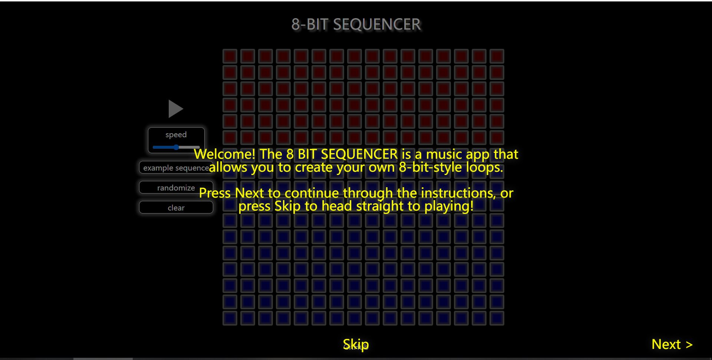
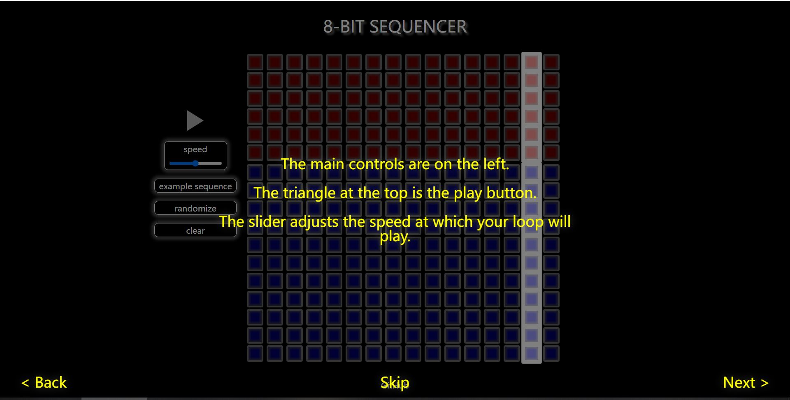
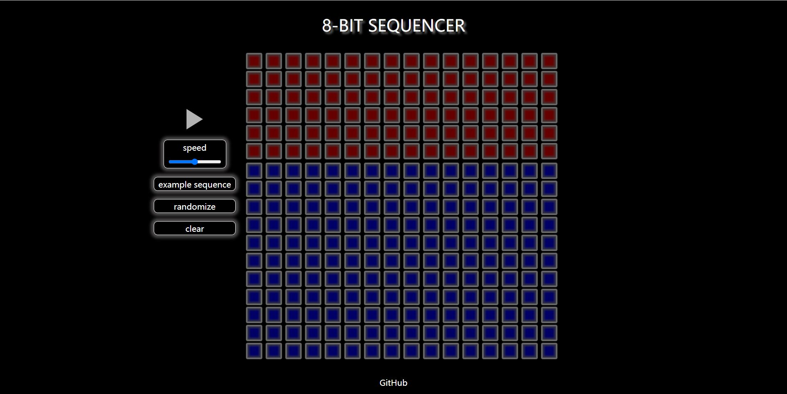
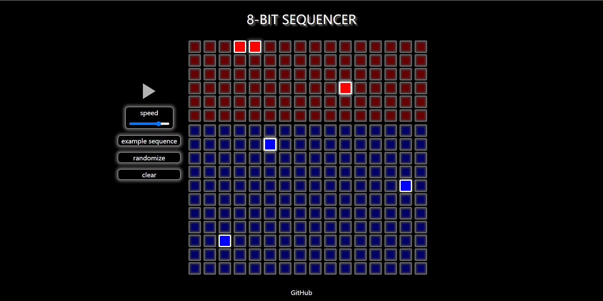
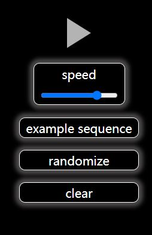
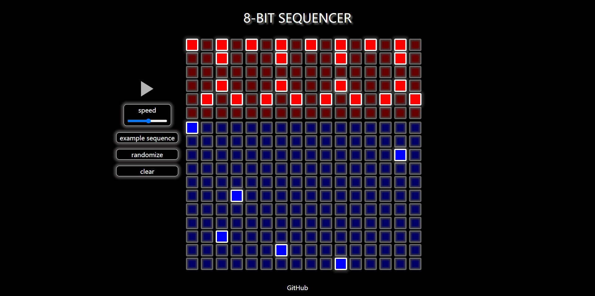
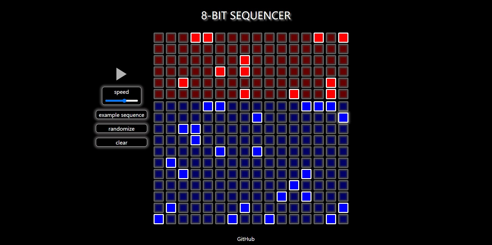
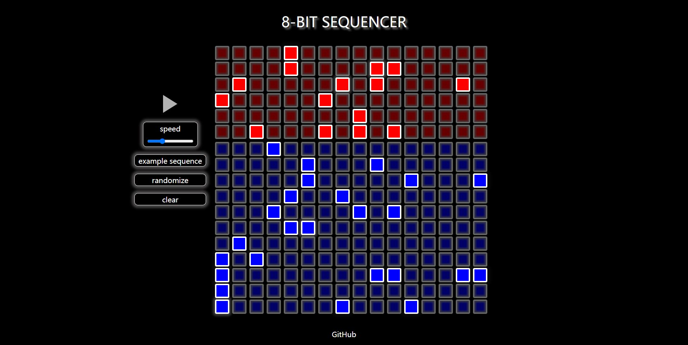
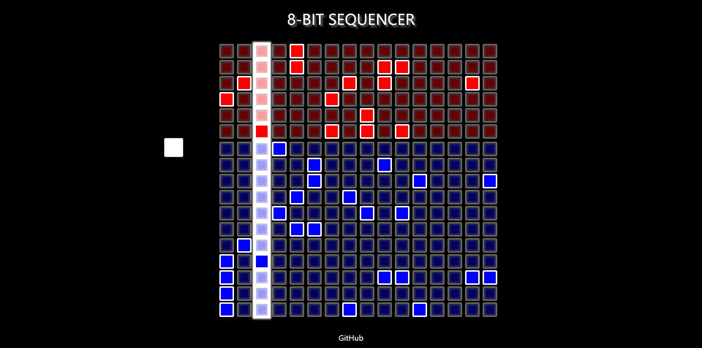

# The 8-BIT SEQUENCER
+ 8-bit music is a genre of electronic music that emulates the sound of vintage video game consoles and computers, using simple waveforms and limited audio channels to create nostalgic, pixelated melodies.
+ The 8-BIT SEQUENCER is an online app that allows users to create their own 8-bit style loops in an easy way. It can also generate random patterns that allow users to explore more potentials.

  [Live Demo](https://10878749.github.io/8bit_sequencer/public)

# Installation and Run
## 1. Requirements
+ Node.js >= Version 16
+ Yarn(package manager)
```bash
npm install --global yarn
```
## 2. Dependency Installation
```bash
yarn.cmd install
```
## 3. Build the Project
```bash
yarn.cmd run build
```
## 4. Run at Localhost
+ First, run the server:
```bash
yarn.cmd run start
```
+ Then open the address shown in console http://localhost:3000

# How to Play
+ When you open the website, you will be greeted with a 6-page instruction, which describes in detail the functions of each section.  
+ The instruction is very simple. You can skip it on any page, but reading it entirely the first time you play it is recommended.
<div>

<div>
<div>

<div>
  
+ The grid of buttons represents a series of sounds that will be played in a loop. 
+ Each color corresponds to a different instrument. The red buttons play the 8-bit style drum beats(in this project they are actually some common 8-bit game sound effects). The blue ones play the note of the square wave synthesizer. 
<div>

<div>
  
+ The sequencer buttons can be turned on with a click. When you turn one button on, it will play the sound it represents and start to glow.
+ To turn one button off, just click it again.
<div>

<div>

+ The control buttons are on the left.
<div>

<div>
  
+ The triangle at the top is the play button.
+ The slider adjusts the speed at which your loop will play.
+ The EXAMPLE SEQUENCE button turns on a pre-set pattern that may inspire you.
<div>

<div>
  
+ The RANDOM button gives you a random speed and  a random pattern.
<div>

<div>
<div>

<div>
  
+ The CLEAR button will clear the entire grid.


+ When playing, the sequencer will highlight and play the sounds that are turned on in a loop at a constant speed.
+ To stop playing, click the glowing square button on the left.

<div>

<div>

+ The drum beats are already set to a suitable volume by a series of tests and all the notes of the synthesizer are from the G Major major pentatonic scale, which is a very harmonious scale.
+ That means you don't need any compositional skills to create a catchy loop! Even the random patterns can surprise you easily!
+ Just a little tip: Do not get greedy and turn on too many buttons. (But of course, you can give it a try).

# Implementation Details

## Tech Stack
+ Language: HTML, CSS, JavaScript
+ Environment: Node.js
+ Libraries/Frameworks: Tone.js(to generate the sounds of the synthesizer), Express.js(web framework for server)
+ Other tools: Webpack(for bundling assets)

## File Organization
+ public/: The folder containing all the static resources that are used to render the page.
  + assets/: The folder containing the static images that are used.
  + samples/: The folder containing the audio samples for the drum part of the sequencer.
  + scripts/: The folder containign the JavaScript files that are used for the web interactivity.
    + *main.js*: The main entry point of the web application.
    + *modal.js*: The codes handling the interactions of the instruction part of the web application.
    + *sequencer.js*: The codes that implement the main function of the web application.
      + 'Synthesizer': This class is responsible for creating a polyphonic synthesizer using the Tone.js library. 
      + 'Sampler': This class sets up audio samples that are played back when triggered.
      + 'Player': This class acts as a manager that decides whether to play a note from the 'Synthesizer' or a sample 'from' the Sampler based on the sound key that it receives. 
      It also includes a parser function to get the sound key from a click event.
      + 'Randomizer': This class is responsible for the random function. It generates a random sequence of button pressed. It also randomizes the tempo (BPM).
      + 'Grid': This class handles the visual aspects of the grid on the webpage. It sets up the grid buttons and other visual elements. It also listens to button clicks to toggle the "turned-on" state and includes methods for clearing and setting example sequences.
      + 'Sequencer': This is the main class tying everything together. It initializes the grid and player, and controls the timing for when to trigger notes or samples. It listens to the play and stop button, starting or stopping the sequence of sounds.
  + styles/: The folder containing the CSS styling file of the web application/
  + *index.html*: The main page file of the web application.
+ node_modules: The folder to storing the project's dependencies.
+ *index.js*: The file setting up a web server using the Express.js framework.
+ *package.json*:  The manifest file that's central project used for managing dependencies and scripts.
+ *webpack.config.js*: The file used for bundling assets.


#### Author
+ Wenjia Luo 10878749 PoliMi
+ wenjia.luo@mail.polimi.it
